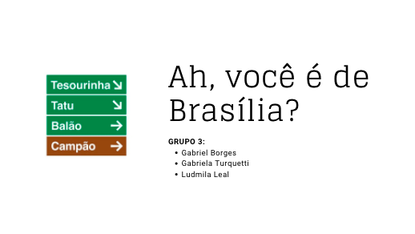

<h1 align="center">➔ Ah, você é de Brasília?</h1>

  

***

### Sobre ✨
* **Quais esteriótipos sobre os brasilienses você tem**? 
* Essa foi a motivação para contar a nossa história, usar diversos esteriótipos que ouvimos com recorrência e tentar quebrá-los com os nossos dados do Google Maps, Youtube e Spotify. 

### Como acessar? ✨
* Para acessar nossa visualização, fique à vontade para explorar nossa análise de dados ou ir direto para a visualização no Tableau, clicando [aqui](https://public.tableau.com/app/profile/gabriela.nunes.turquetti/viz/Projeto-Final-Resilia/Brasilia). 

<h3 align="center"> GRUPO 3 </h3> 

  <a href="https://github.com/soaresana"> Gabriel Borges </a> |
  <a href="https://github.com/turquetti"> Gabriela Turquetti </a> |
  <a href="https://github.com/LudmilaLeal"> Ludmilla Leal </a>

